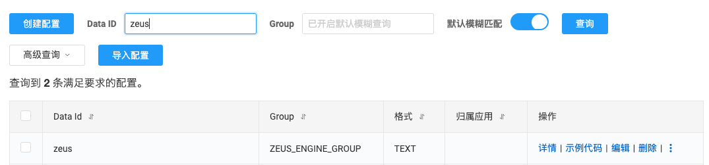

## ZEUS-ENGINE 宙斯规则引擎
<div align="center">
    <center>
        
    </center>
</div>
<p align="center">
  <a href="#项目交流"></a>
  <a href="#项目交流"></a>
  <a href="#项目交流"></a>
  <a href="#项目交流"></a>
</p>

## ZEUS 介绍

项目背景：业务开发逻辑变更频繁，灵活度不够。对于一些非核心流程又频繁改动的部分使用动态脚本代替

核心功能：**Java应用无须发布上下线，动态变更业务逻辑，对象实例均交由Spring管理**

不适用场景：不存在的SDK和对象无法通过groovy脚本编译

## ZEUS 使用手册

### 引入maven依赖
```xml
<dependency>
   <groupId>com.zeus</groupId>
   <artifactId>zeus-starter</artifactId>
   <version>1.0-SNAPSHOT</version>
</dependency>
```
### 配置信息

在接入`ZEUS`的项目配置文件中填写`ZEUS`相关的配置信息

`nacos`分布式配置中心示例：

```properties
nacos.config.server-addr=127.0.0.1:8848
nacos.config.username=nacos
nacos.config.password=nacos
nacos.config.namespace=dev
nacos.config.enabled=true

# zeus param you should write
zeus.enabled=true
zeus.config-name=zeus # nacos配置的Data ID
```
1、在nacos配置中心新增主配置，Data ID需要与配置文件保持一致，Group为```ZEUS_ENGINE_GROUP```

配置内容为:
```json
{
    "instanceNames": [
        "com.zeus.example.service.DingSmsService"
    ],
    "updateTime": "1732899422"
}
```
instanceNames为需要动态加载的类名，updateTime为版本号/版本时间戳，每次修改脚本后，需要更新版本号，否则脚本不会生效。

2、可选择直接添加Java代码，注意不要用**lombok**和**lambda**，groovy不支持编译。
Data ID为需要动态加载的类名，Group需要使用```ZEUS_ENGINE_GROUP```
```java
package com.zeus.example.service;

import javax.annotation.Resource;

public class DingSmsService implements SendService{

    @Resource
    private DependencyService dependencyService;

    @Override
    public String send() {
        System.out.println(dependencyService.getZeusClient());
        System.out.println("send ding msg");
        return "send ding msg";
    }
}

```

注：`zeus`所有的配置内容**在分布式配置中心**默认均为`txt`格式。`zeus`会监听以上配置的变更，当新增或修改了`Groovy`脚本时，需要**手动**更新主配置。

### 使用客户端
客户端使用ZeusClient获取对象或执行方法
```java
@Slf4j
@RestController
@RequestMapping("/v1/send")
public class SendApi {

    @Resource
    private ZeusClient zeusClient;

    @GetMapping("/test")
    public void test() {

        // 获取脚本对象 用接口接收
        SendService sendService = zeusClient.getInterfaceByName("com.zeus.example.service.DingSmsService");
        sendService.send();

        // 获取GroovyObject对象
        GroovyObject groovyObject = zeusClient.getGroovyObjectByName("com.zeus.example.service.DingSmsService");
        groovyObject.invokeMethod("send", null);
        log.info("groovy object : [{}]", groovyObject);

        // 直接执行脚本对应的方法，得到返回值
        Object sendRes = zeusClient.execute("com.zeus.example.service.DingSmsService", "send", null);
        log.info("sendRes : [{}]", sendRes);

    }

}
```
